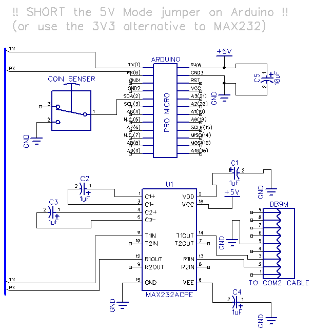

# wacca-vfd-arduino

Controls the VFD display of WACCA cabinet from an Arduino.

[example video](https://twitter.com/akasaka_spk/status/1659505635078311936)

## Schematic



Rx,Tx of Arduino Pro Micro -> MAX232 -> Tx,Rx of VFD display (COM2 cable on WACCA cabinet)

Pin 2 of Arduino -> Coin selector (N-O contact)

Gnd of Arduino -> Coin selector (COM contact)

For other connections around MAX232 see tutorials online such as the one in [DIYODE Magazine](https://diyodemag.com/education/the_classroom_rs232_the_max232_ic_arduino_uno).

For RS232 pinout see e.g. [PinoutGuide](https://pinoutguide.com/SerialPorts/Serial9_pinout.shtml)

## Thanks

Thanks to Obiwan for helping with this protocol. 

Thanks to [image2cpp](https://javl.github.io/image2cpp/) for helping to convert the graphics.

## Graphics Data Format

1 bit, recorded as bytes where each byte is a quarter column. Thus the screen is laid out like this: 

```
[0][4][8]
[1][5][9]
[2][6]...
[3][7]...
```

When converting on image2cpp you can upload a horizontal image and then enable *Rotate: 90* and *Flip: horizontally* to get the correct data bytes.